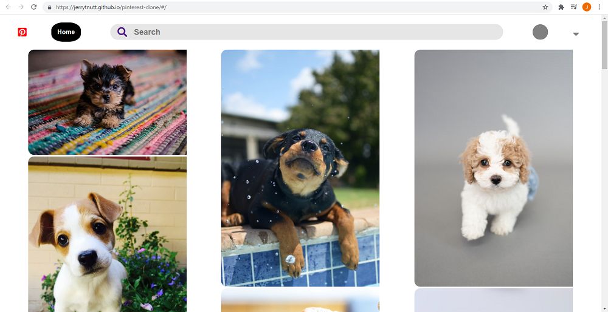

# Pinterest clone created with React.

# Features
- User Authentication
- Uses Unsplash API to search for photos
- Uses Firebase on the backend to store user ID and photo collections
- User can search and save collection of their favorite photos
# Live Demo
View [Live Demo](https://jerrytnutt.github.io/pinterest-clone/)

# Preview

